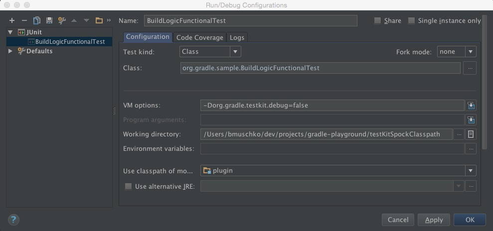

## New and noteworthy

Here are the new features introduced in this Gradle release.

<!--
IMPORTANT: if this is a patch release, ensure that a prominent link is included in the foreword to all releases of the same minor stream.
Add-->

<!--
### Example new and noteworthy
-->

### Debugging of tests executed with TestKit API from an IDE

Identifying the root cause of a failing functional test can be tricky. Debugging test execution from an IDE can help to discover problems
by stepping through the code line by line. By default TestKit executes functional tests in a forked daemon process. Setting up remote debugging for a daemon process
is inconvenient and cumbersome.

This release makes it more convenient for the end user to debug tests from an IDE. By setting the system property `org.gradle.testkit.debug` to `true` in the IDE run configuration,
a user can execute the functional tests in the same JVM process as the spawning Gradle process.

The following screenshot shows a JUnit run configuration in IntelliJ:

Alternatively, debugging behavior can also be set programmatically through the `GradleRunner` API with the method
<a href="javadoc/org/gradle/testkit/runner/GradleRunner.html#withDebug(boolean)">withDebug(boolean)</a>.

## Promoted features

Promoted features are features that were incubating in previous versions of Gradle but are now supported and subject to backwards compatibility.
See the User guide section on the “[Feature Lifecycle](userguide/feature_lifecycle.html)” for more information.

The following are the features that have been promoted in this Gradle release.

<!--
### Example promoted
-->

## Fixed issues

## Deprecations

Features that have become superseded or irrelevant due to the natural evolution of Gradle become *deprecated*, and scheduled to be removed
in the next major Gradle version (Gradle 3.0). See the User guide section on the “[Feature Lifecycle](userguide/feature_lifecycle.html)” for more information.

The following are the newly deprecated items in this Gradle release. If you have concerns about a deprecation, please raise it via the [Gradle Forums](http://discuss.gradle.org).

<!--
### Example deprecation
-->

## Potential breaking changes

<!--
### Example breaking change
-->

## External contributions

We would like to thank the following community members for making contributions to this release of Gradle.

<!--
* [Some person](https://github.com/some-person) - fixed some issue (GRADLE-1234)
-->

We love getting contributions from the Gradle community. For information on contributing, please see [gradle.org/contribute](http://gradle.org/contribute).

## Known issues

Known issues are problems that were discovered post release that are directly related to changes made in this release.
